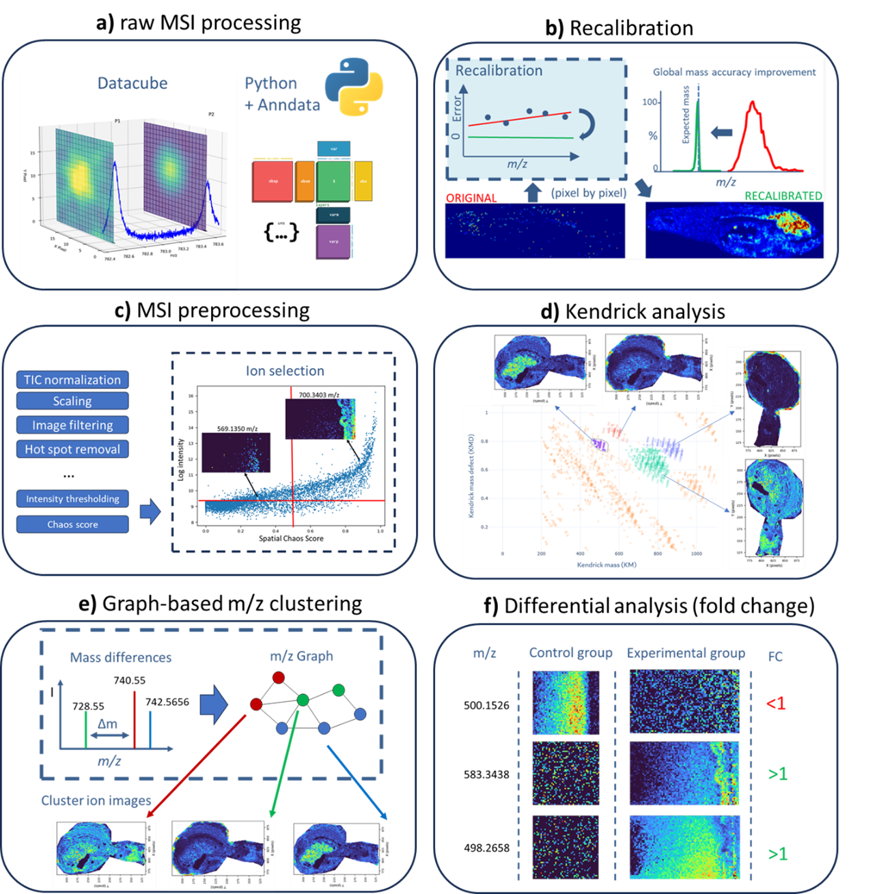

# deltamsi

This repository contains a python package for High-Resolution Mass Spectrometry Imaging (MSI) analysis.

Developed during the PhD thesis *"High-Resolution Mass Spectrometry Imaging: From Mass-Shift Correction to Graph-Based Molecular Interpretation"* by Raphaël La Rocca, `deltamsi` provides a unified analysis framework for spatial metabolomics and lipidomics built on top of [AnnData](https://anndata.readthedocs.io/). The central `MSICube` object handles everything from loading raw `.imzML` files to preprocessing, peak picking, spatial analysis, and visualization.

<p align="center"></p>

Overview of the main functionalities implemented in deltamsi for high-resolution MSI processing and interpretation.(a) Raw MSI processing and data representation: conversion of raw MSI data into a datacube-like representation in Python, organized in an AnnData-backed structure for efficient access and metadata handling.(b) Recalibration: pixel-wise (or spectrum-wise) mass-shift correction to improve mass accuracy, illustrated by the reduction of m/z error and improved peak alignment, leading to cleaner and more consistent ion images after recalibration.(c) MSI preprocessing and feature selection: typical preprocessing steps (e.g., TIC normalization, scaling, image filtering, hot-spot removal) followed by intensity thresholding and spatial-structure scoring (chaos score) to support ion/feature selection.(d) Kendrick analysis: Kendrick mass defect visualization used for exploratory analysis and interactive selection/labeling of ions of interest, with corresponding ion images.(e) Graph-based m/z clustering: construction of an ion graph from expected mass differences (Δm) and/or spatial similarity (colocalization), followed by clustering to obtain molecular groups and cluster-level aggregated ion images.(f) Differential analysis between conditions: comparison of control versus experimental groups using fold-change metrics (intensity and/or spatial-structure/chaos-derived criteria), illustrated by ion images and fold-change direction.

## Features

- **Data loading** - import one or more `.imzML`/`.ibd` files into a single multi-sample object
- **Preprocessing** - TIC normalization, log-transformation, hotspot capping, median filtering, quantile thresholding
- **Spectral processing** - mean spectrum computation, peak picking, intensity matrix extraction
- **Spatial analysis** - cosine colocalization, spatial chaos scoring, Kendrick mass defect analysis
- **Mass recalibration** - internal recalibration against a reference database
- **Discriminant analysis** - rank ions between groups
- **Visualization** - ion images, mean spectrum plots, Kendrick diagrams
- **Persistence** - save/load in `h5ad` (HDF5) or `zarr` format

## Requirements

- Python `>=3.11, <3.13`
- [uv](https://docs.astral.sh/uv/) (recommended) or pip

## Installation with uv

### Clone and set up the environment

```bash
git clone https://github.com/LaRoccaRaphael/deltamsi.git
cd deltamsi
uv sync
```

This creates a `.venv` and installs all core dependencies from `uv.lock`.

With optional extras:

```bash
# Visualization tools (matplotlib, seaborn, scanpy, plotly, jupyterlab, ...)
uv sync --extra viz

# Network analysis utilities
uv sync --extra analysis

# Multiple extras at once
uv sync --extra viz --extra analysis
```

For development (includes linting, testing, and docs tools):

```bash
uv sync --all-extras --dev
```

### Use in another project (once published to PyPI)

```bash
uv add deltamsi
uv add "deltamsi[viz]"          # with visualization extras
uv add "deltamsi[viz,analysis]" # multiple extras
```

### Install from a local checkout into another project

```bash
uv add /path/to/deltamsi
uv add "/path/to/deltamsi[viz]"
```

## Quick start

```python
import deltamsi as dm

# 1. Point to the directory containing your .imzML and .ibd files
cube = dm.MSICube("./data/my_experiment/")
# INFO: MSICube initialized with 3 samples found.

# 2. Load spectra into an AnnData object
cube.load_mean_spectrum()      # compute per-sample mean spectra
cube.combine_mean_spectra()    # align and merge into a global mean spectrum
cube.pick_peaks()              # detect peaks on the combined spectrum
cube.extract_peak_matrix()     # fill the intensity matrix (pixels × peaks)

# 3. Preprocess
cube.tic_normalize()
cube.log1p_intensity()

# 4. Explore
dm.plot_ion_images(cube.adata, mz_values=[756.5, 885.5], ncols=2)
dm.plot_mean_spectrum_windows(cube.adata)

# 5. Save
cube.save()                        # saves to ./data/my_experiment/adata.h5ad
cube.save(file_format="zarr")      # or zarr for large datasets
```
## Example notebooks

The example notebooks directory contains worked examples illustrating how `deltamsi` can be applied to different real MSI datasets. Together, these notebooks showcase complementary use cases of the package, including recalibration, differential analysis, fold-change-based ion ranking, and graph-based molecular interpretation.

- `deltamsi_recalibration.ipynb` demonstrates the recalibration workflow implemented in `deltamsi`, based on the method described in [DOI: 10.1021/acs.analchem.0c05071](https://doi.org/10.1021/acs.analchem.0c05071). The notebook applies this strategy to zebrafish MSI data available from the [METASPACE project page](https://metaspace2020.org/project/rocca-2021?tab=datasets).

- `deltamsi_microbacterial_colonies.ipynb` presents a graph-based mass-difference clustering workflow to identify molecular families produced by *Pseudomonas sessilinigenes* CMR12a32 bacterial colonies grown on agar. The corresponding dataset is available in [METASPACE](https://metaspace2020.org/project/rocca-2025?tab=datasets), and the associated study is described in [DOI: 10.1021/jasms.5c00055](https://doi.org/10.1021/jasms.5c00055).

- `deltamsi_DA.ipynb` reproduces the ISF workflow introduced in [DOI: 10.1021/jasms.4c00129](https://doi.org/10.1021/jasms.4c00129) to investigate how iron availability regulates metabolism in *S. scabiei*, with a particular focus on siderophore production under iron-depleted conditions. It also shows how graph-based mass-difference clustering can be applied to condition-specific ions and how `deltamsi` can rank ions based on fold change between conditions. The dataset used in this notebook is available in [METASPACE](https://metaspace2020.org/project/Burguet-2026?tab=datasets).
- 
## Running tests

```bash
uv run pytest
```

With coverage:

```bash
uv run pytest --cov=src/deltamsi
```

## Building documentation

```bash
uv run --group dev sphinx-build docs/source docs/_build/html
```

## Project structure

```
src/deltamsi/
├── core/           # MSICube - the main analysis object
├── processing/     # Normalization, peak picking, colocalization, recalibration, ...
├── plotting/       # Ion images, spectra, Kendrick plots
├── params/         # Typed parameter / options dataclasses
└── utils/          # Validation helpers
```

## How to cite

If you use `deltamsi` in your research, please cite:

```bibtex
@software{deltamsi,
  author  = {La Rocca, Raphaël},
  title   = {deltamsi: A Scanpy-like Python package for High-Resolution Mass Spectrometry Imaging analysis},
  year    = {2026},
  url     = {https://github.com/LaRoccaRaphael/deltamsi},
}
```

## License

BSD 3-Clause - see [LICENSE](LICENSE).
